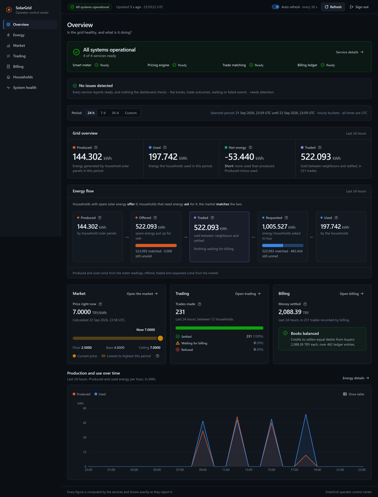
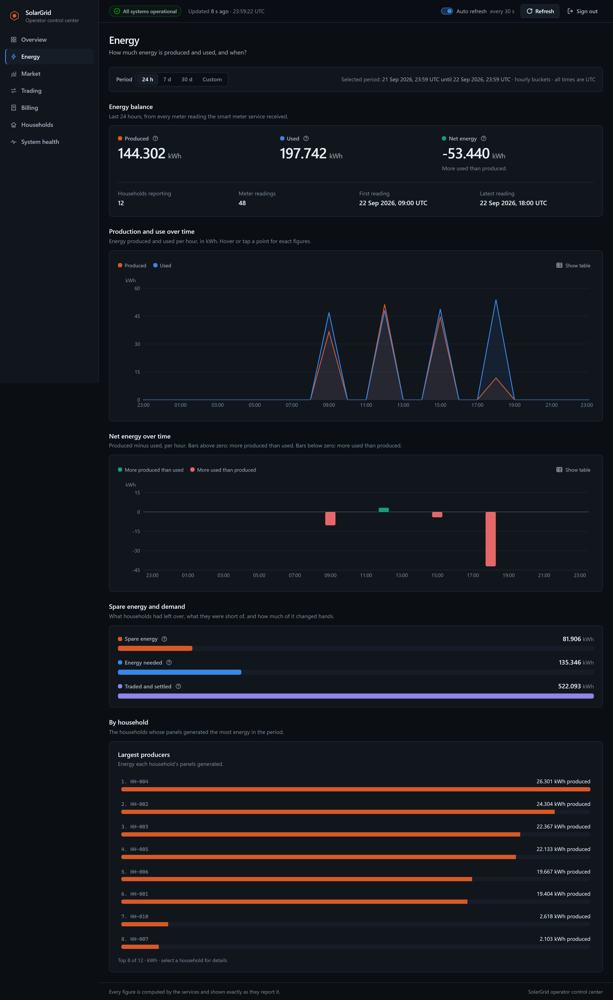
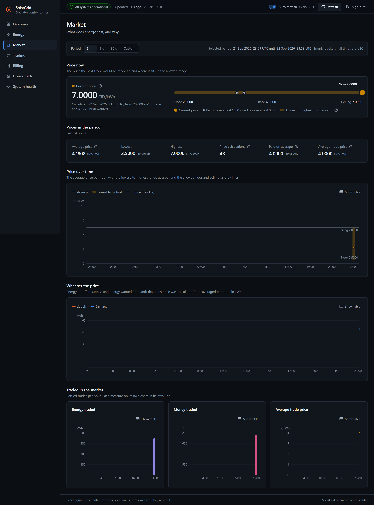
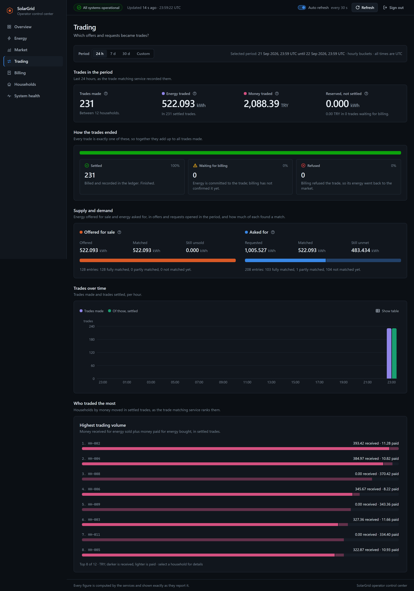
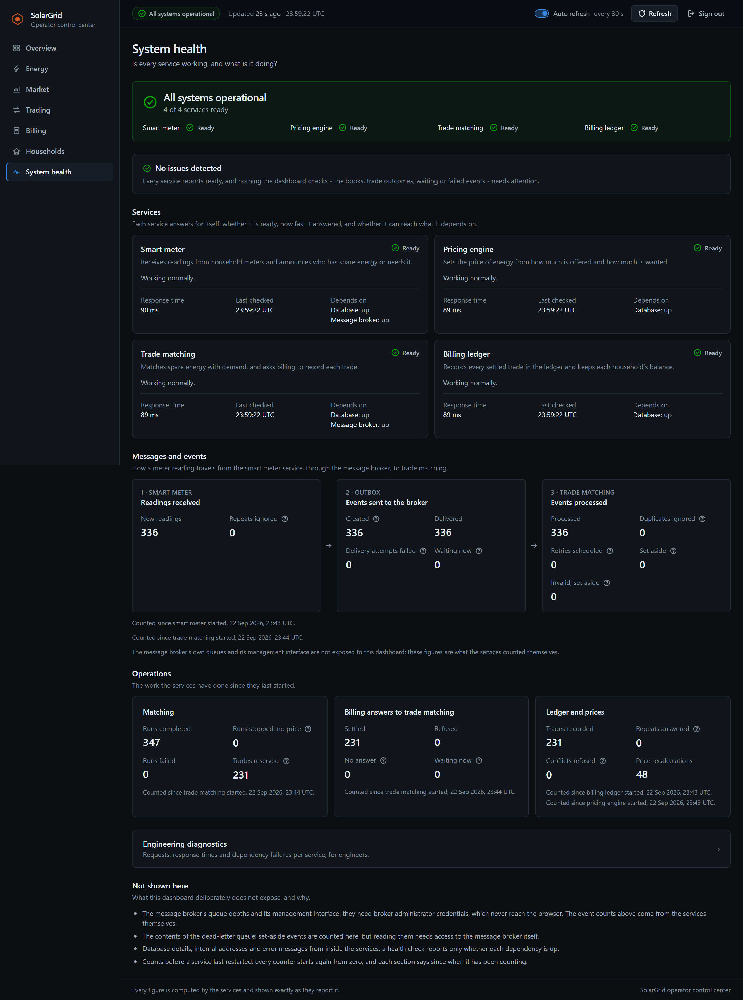
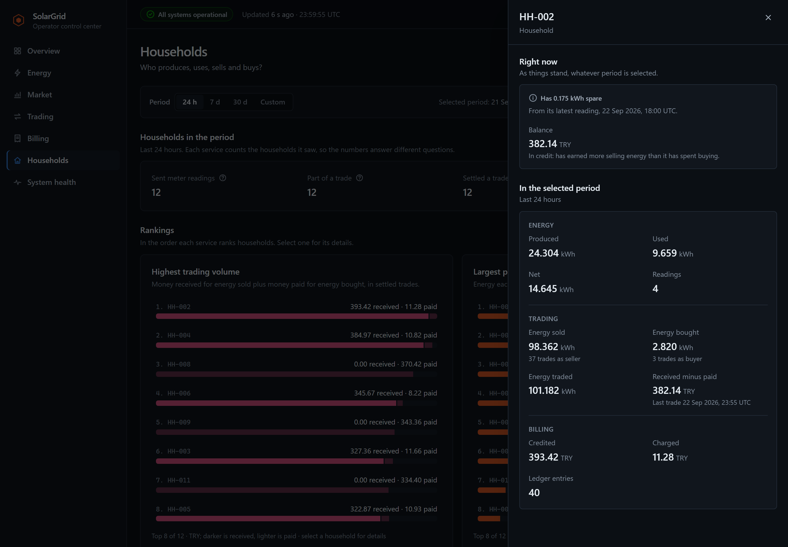

# Solar Grid

Solar Grid is a CENG442 microservice architecture project for neighborhood-level peer-to-peer renewable energy trading. Households with surplus solar production can sell energy to households with demand.

## Screenshots

The operator control center, reading the four services' statistics, diagnostics
and readiness endpoints from the browser. Every figure below is what the
services reported for a week of generated meter readings on a local stack; the
households are demo identifiers, not real ones.



| Energy                                                                                                               | Market                                                                                                         |
| -------------------------------------------------------------------------------------------------------------------- | -------------------------------------------------------------------------------------------------------------- |
| [](docs/screenshots/energy.png) | [](docs/screenshots/market.png) |

| Trading                                                                                                                 | System health                                                                                                                                    |
| ----------------------------------------------------------------------------------------------------------------------- | ------------------------------------------------------------------------------------------------------------------------------------------------ |
| [](docs/screenshots/trading.png) | [](docs/screenshots/system-health.png) |

A household's detail panel, opened from the Households page:



`docs/screenshots/` also holds the Billing and Households pages in full.

## Services

| Service                | Port         | Responsibility                                                                                       |
| ---------------------- | ------------ | ---------------------------------------------------------------------------------------------------- |
| smart-meter-service    | 3001         | Receives smart meter readings, calculates household energy state, publishes surplus/demand events    |
| pricing-engine-service | 3002         | Maintains pricing rules and calculates current price per kWh                                         |
| trade-matching-service | 3003         | Consumes RabbitMQ events, creates offers/requests, performs FIFO matching, calls Pricing and Billing |
| billing-ledger-service | 3004         | Records completed trades, ledger entries, balances, and billing idempotency                          |
| RabbitMQ               | 5672 / 15672 | Event broker and management UI                                                                       |
| dashboard              | 8080         | Operator control center: system status, energy, market, trading, billing, households, service health |

Each microservice owns a separate PostgreSQL database. The dashboard owns none:
it reads the services' statistics APIs from the operator's browser.

## Architecture

```text
POST /readings
    |
    v
smart-meter-service
    | publishes EnergySurplusDetected / EnergyDemandDetected
    v
RabbitMQ exchange: solar-grid.energy
    |
    v
trade-matching-service
    | GET /prices/current
    v
pricing-engine-service
    |
    | POST /trades
    v
billing-ledger-service
```

Communication patterns:

- RabbitMQ topic events from Smart Meter to Trade Matching.
- REST from Trade Matching to Pricing.
- REST from Trade Matching to Billing.
- `x-correlation-id` is propagated through events and REST headers.

## Reliability Notes

- A reading and the event it produces are written in one database transaction,
  and a publisher moves the event to RabbitMQ afterwards, so a broker outage
  delays events instead of losing them.
- Events are persistent, carry `eventId`, `correlationId`, `occurredAt`,
  `sourceEventId` and a schema `version`, and are published with `mandatory` so
  one with nowhere to go comes back instead of disappearing.
- A failing message is retried with a growing delay up to `RABBITMQ_MAX_RETRIES`
  times and is then parked in `trade-matching.energy.dlq` with the reason in its
  headers. Nothing is redelivered forever.
- Duplicate delivery is expected: `sourceEventId` is unique on offers and
  requests, trades carry a stable idempotency key, and the ledger refuses to
  record the same settlement twice.
- Energy is reserved on both sides before billing is called and released only
  if billing refuses outright, so the same kilowatt hours cannot be sold or
  charged twice.
- Consumer prefetch is `1`: matching is serialised by a database lock anyway.
- `/health/live` never touches a dependency; `/health/ready` checks the database
  and, where it matters, the broker. A shutting-down service finishes the
  messages in hand before it closes.

[docs/event-flow.md](docs/event-flow.md) walks through how an event is created,
how it crosses RabbitMQ, what happens when it fails and how it reaches the dead
letter queue. [docs/reliability.md](docs/reliability.md) lists the guarantees
and the test that proves each one.

### Looking at the queues

```bash
docker exec solar-grid-rabbitmq rabbitmqctl list_queues name messages consumers
```

The management UI is at http://localhost:15672 (`RABBITMQ_USER` /
`RABBITMQ_PASSWORD` from `infrastructure/.env`), where a parked
message can be inspected and republished once the cause is fixed.

## Security

- Reads of a single record and meter readings are public. Everything that
  changes how the market behaves, and every aggregate over the whole
  neighbourhood, needs a token:

  | Endpoint                                         | Token                                        |
  | ------------------------------------------------ | -------------------------------------------- |
  | `POST /matching/run`, `POST /prices/recalculate` | `OPERATOR_API_TOKEN`                         |
  | `GET /stats/*` on every service                  | `OPERATOR_API_TOKEN`                         |
  | `POST /trades`                                   | `INTERNAL_API_TOKEN`, sent by trade-matching |

- No token is `401`, the other role's token is `403`. Tokens come from the
  environment, are compared in constant time, and never appear in logs or
  responses.
- Every error has one shape - `statusCode`, `code`, `message`, `correlationId` -
  and a 5xx never reveals what went wrong inside.
- Unknown fields are rejected, lists are paged with a hard maximum, money is
  validated as decimal strings, and the same idempotency key with a different
  payload is a `409`.
- Rate limited per client, helmet headers, CORS off unless origins are listed,
  Swagger off in production unless enabled.

[docs/api-security.md](docs/api-security.md) covers all of it.

### Calling the API locally

The tokens are the ones `pnpm env:init` generated in `infrastructure/.env`:

```bash
OPERATOR=$(sed -n 's/^OPERATOR_API_TOKEN=//p' infrastructure/.env)
curl -i -X POST http://localhost:3003/matching/run                                       # 401
curl -s -X POST http://localhost:3003/matching/run -H "Authorization: Bearer $OPERATOR"  # 200
curl -s "http://localhost:3003/matches?status=COMPLETED&limit=10"                         # public, paged
```

## Operations

- **No credential has a default.** `pnpm env:init` writes random secrets to
  `infrastructure/.env`; compose will not start without them, and a service in
  production refuses short, default or placeholder credentials.
- **Least-privileged database access.** Migrations run in a one-shot job as the
  database owner. The services connect as `solargrid_app`, which owns nothing
  and holds only per-table grants - billing's ledger cannot be updated or
  deleted even by billing.
- **Small, hardened images.** Multi-stage builds, production dependencies only,
  no package managers or Prisma CLI, a non-root user, a read-only filesystem,
  no Linux capabilities, memory and CPU limits.
- **`/health/live` and `/health/ready`.** Readiness checks the database and,
  where it matters, the broker; compose waits on it.
- **Graceful shutdown.** On SIGTERM a service stops consuming, finishes the
  work in hand, then closes HTTP, the broker and the database, in that order.

[docs/operations.md](docs/operations.md) covers all of it.

## Observability

- **Structured logs.** One JSON object per line, with a stable `event` name
  (`message.retry.scheduled`, `trade.settled`, `readiness.changed`, ...) and the
  identifiers to trace it: `correlationId`, `eventId`, `tradeId`, `attempt`,
  `durationMs`. Tokens, passwords and request bodies are never written.
- **One correlation id per operation.** It follows a reading from the HTTP
  request through the outbox, RabbitMQ, trade-matching, pricing and billing to
  the ledger, in every row and log line on the way:
  `docker compose -f infrastructure/docker-compose.yml logs --no-color | grep <id>`.
- **Metrics.** `GET /metrics` on every service, in Prometheus text format, for
  a scraper holding `METRICS_TOKEN`: HTTP traffic, dependency failures, retries
  and dead letters, the outbox, trades waiting for billing, settlements.
- **Outages are tested.** Integration tests stop and start the real database and
  broker and switch pricing and billing off; `bash scripts/resilience.sh` does
  the same to the Docker stack.

[docs/observability.md](docs/observability.md) describes the logs and metrics;
[docs/troubleshooting.md](docs/troubleshooting.md) goes from a symptom to its
cause and the way back.

## Statistics

Every service answers `GET /stats/...` for the data it owns, read-only and with
the operator token:

```bash
OPERATOR=$(sed -n 's/^OPERATOR_API_TOKEN=//p' infrastructure/.env)
curl -s -H "Authorization: Bearer $OPERATOR" localhost:3001/stats/summary   # energy recorded
curl -s -H "Authorization: Bearer $OPERATOR" localhost:3003/stats/summary   # what traded, at what price
curl -s -H "Authorization: Bearer $OPERATOR" localhost:3004/stats/summary   # what settled, what the ledger holds
curl -s -H "Authorization: Bearer $OPERATOR" "localhost:3003/stats/trends?bucket=day"  # a series for a chart
```

- Windows are UTC and half open: `from` is included, `to` is not.
- Trends come back as a complete series - a quiet bucket reports zeros rather
  than being left out - in hour, day or week buckets.
- Sums, averages and per-household figures are computed by PostgreSQL over the
  exact decimal columns and returned as decimal strings. An average over no
  rows is `null`, not zero.
- Nothing is copied into a reporting database: each service aggregates its own
  tables, and a dashboard asks all four.

[docs/analytics.md](docs/analytics.md) documents every endpoint, filter and
limit.

## Operator control center

http://localhost:8080, once the stack is up. Sign in with `OPERATOR_API_TOKEN`
from `infrastructure/.env`.

- Seven pages - Overview, Energy, Market, Trading, Billing, Households and
  System health - each opening with the question it answers.
- The overview says first whether everything works ("All systems
  operational", "System degraded", "System unavailable") and lists what needs
  attention in plain words, with what it means and where to look.
- The grid in four figures, the energy flow from panels to market to use, the
  price between its floor and ceiling, how every trade ended, and whether the
  books balance - all as the services reported them, nothing made up.
- Charts with one axis each, a legend, exact tooltips and a table twin;
  24 hours, 7 days, 30 days or custom dates, in UTC; refresh that never
  overlaps, pauses in a hidden tab and says how old the figures are.
- Households: rankings, searchable lists and a detail panel per household.
- System health: every service's state and dependencies, the path of a meter
  event through the broker, and each service's own counters from its
  operator-only `GET /diagnostics` - without exposing the broker's management
  interface or any credential.
- React, TypeScript, Vite, Tailwind CSS and Recharts; one typed client for
  every request; Vitest, Testing Library and axe-core in the tests.
- The token lives in the tab's session storage, is sent only as a bearer
  header, and is never shown again after sign-in. The page only runs its own
  scripts and only talks to the four services.
- Served as static files by an unprivileged, read-only nginx container.

```bash
pnpm dashboard:dev     # http://localhost:5173 against the services in Docker
```

[docs/dashboard.md](docs/dashboard.md) covers the architecture, the session,
configuration and its limits.

## Prerequisites

- Docker and Docker Compose v2
- Node.js >= 24 (see `.nvmrc`)
- pnpm 10 — `corepack enable` picks the pinned version up from package.json

## Validation Commands

Run these before the live demo:

```bash
pnpm install --frozen-lockfile
pnpm prisma:generate   # required before the first build: the Prisma client is generated, not committed
pnpm lint
pnpm typecheck
pnpm test
pnpm build
pnpm env:init          # once: generates infrastructure/.env
docker compose -f infrastructure/docker-compose.yml up -d --build --wait
bash scripts/demo.sh
```

PowerShell demo:

```powershell
powershell -ExecutionPolicy Bypass -File scripts/demo.ps1
```

## Tests

```bash
pnpm test               # every unit suite, and the dashboard's
pnpm test:integration   # the Testcontainers suites, which `pnpm test` leaves out
pnpm --filter @solar-grid/dashboard test   # the dashboard on its own
```

- **Unit tests** cover the matching planner, the pricing formula, decimal
  handling, the outbox publisher, the event consumer, graceful shutdown, and
  the shared HTTP layer (auth, the error filter, rate limits, readiness, and
  the log redaction that keeps tokens and passwords out of the output).
- **Integration tests** run against a real PostgreSQL and a real RabbitMQ
  started by Testcontainers, not mocks. They stop and restart those containers
  mid-test to check that an outage is survived, that a duplicate delivery does
  not create a second trade or ledger entry, that the paged endpoints refuse an
  oversized page, and that the runtime database role really cannot touch what
  it has no grant for.
- **Dashboard tests** use Vitest and Testing Library against the real page
  components, with axe-core asserting no accessibility violations.
- **End-to-end**: `scripts/demo.sh` (or `scripts/demo.ps1`) drives the running
  Docker stack from a meter reading to a settled ledger entry and checks each
  step. `scripts/resilience.sh` stops and starts real containers and checks that
  each outage is reported, survived without losing or duplicating money, and
  recovered from.

Docker is required for the integration suites and for both scripts.

## Local Port Conflicts

Every published port binds to `127.0.0.1` and can be remapped without editing
the compose file. The PostgreSQL containers publish no host ports at all; use
`docker compose exec postgres-smart-meter psql -U postgres smart_meter_db` for
a shell, or start the stack with `infrastructure/docker-compose.dev-ports.yml`
as a second `-f` argument when you want to reach a database from your machine.

```bash
pnpm env:init   # if infrastructure/.env does not exist yet
# edit the ports that collide in infrastructure/.env, then
docker compose -f infrastructure/docker-compose.yml up -d --build --wait
```

The demo scripts follow the same values:

```bash
SMART_METER_URL=http://localhost:13001 PRICING_URL=http://localhost:13002 MATCHING_URL=http://localhost:13003 BILLING_URL=http://localhost:13004 bash scripts/demo.sh
```

PowerShell:

```powershell
$env:SMART_METER_URL="http://localhost:13001"
$env:PRICING_URL="http://localhost:13002"
$env:MATCHING_URL="http://localhost:13003"
$env:BILLING_URL="http://localhost:13004"
powershell -ExecutionPolicy Bypass -File scripts/demo.ps1
```

## Docker Compose

Start (after `pnpm env:init`):

```bash
docker compose -f infrastructure/docker-compose.yml up -d --build --wait
```

`docker compose ps -a` then shows ten healthy containers - four services, four
databases, the broker and the dashboard - and four migration jobs that exited
with status 0.

Logs:

```bash
docker compose -f infrastructure/docker-compose.yml logs -f
```

Stop:

```bash
docker compose -f infrastructure/docker-compose.yml down
```

Clean volumes:

```bash
docker compose -f infrastructure/docker-compose.yml down -v --remove-orphans
```

## API Documentation

The Docker stack runs with `NODE_ENV=production`, where Swagger is off. Set
`SWAGGER_ENABLED=true` in `infrastructure/.env` and restart to get it; when a
service runs with `pnpm start:dev` it is on by default.

Swagger UI:

- Smart Meter: http://localhost:3001/api
- Pricing Engine: http://localhost:3002/api
- Trade Matching: http://localhost:3003/api
- Billing & Ledger: http://localhost:3004/api

RabbitMQ Management:

- http://localhost:15672
- `RABBITMQ_USER` and `RABBITMQ_PASSWORD` from `infrastructure/.env`

## Repository Structure

```text
SolarGrid/
  apps/
    smart-meter-service/
    pricing-engine-service/
    trade-matching-service/
    billing-ledger-service/
  frontend/               # the operator control center (React, Vite, nginx)
  packages/
    shared-contracts/     # event and DTO types shared between services
    shared-utils/         # decimals, ids, correlation ids
    nest-common/          # HTTP plumbing: auth, validation, errors, pagination, rate limits
  infrastructure/
    docker-compose.yml
    .env.example
    postgres/create-app-role.sh   # the least-privileged runtime role
  docs/
    screenshots/          # the dashboard images used in this README
  scripts/
    demo.sh
    demo.ps1
    resilience.sh
  package.json
  pnpm-lock.yaml
  pnpm-workspace.yaml
```

## Known Limitations

This is a course project built to demonstrate a microservice architecture, and
it is scoped accordingly:

- **Single node everywhere.** One RabbitMQ broker and one PostgreSQL instance
  per service, with no clustering, replication or backups. A lost volume is
  lost data.
- **No transport security.** Services speak plain HTTP and are published only
  on `127.0.0.1`. Anything beyond a local machine would need TLS in front.
- **Shared tokens, not users.** Authorisation is three static bearer tokens for
  three roles, read from the environment. There is no per-user identity, no
  session lifetime and no rotation mechanism; households are identifiers, not
  accounts.
- **No money actually moves.** The ledger records what each household owes or
  is owed. There is no payment provider, settlement or dispute handling.
- **The price is a formula, not a market.** A supply/demand ratio clamped
  between a floor and a ceiling, recalculated on demand - not an order book or
  an auction.
- **Matching is serialised.** One matching run at a time, guarded by a database
  lock, and FIFO rather than price-ranked. It is correct under concurrency, not
  optimised for throughput; no load testing has been done.
- **The dashboard polls.** It re-reads the statistics endpoints on an interval.
  There is no streaming, and no server-side aggregation or caching layer.
- **Observability stops at the endpoints.** Logs are structured and `/metrics`
  is Prometheus text, but the stack ships no Prometheus, Grafana or tracing
  backend; correlation ids are followed with `grep`.
- **No CI pipeline or deployment manifests.** The checks above are run locally;
  there is nothing beyond Docker Compose for running this anywhere else.

## Documentation

| Doc                                                | Purpose                                                                           |
| -------------------------------------------------- | --------------------------------------------------------------------------------- |
| [docs/architecture.md](docs/architecture.md)       | Final service architecture and communication patterns                             |
| [docs/api-contracts.md](docs/api-contracts.md)     | REST endpoints and payload examples                                               |
| [docs/event-flow.md](docs/event-flow.md)           | RabbitMQ topology, routing keys, and flow                                         |
| [docs/database-design.md](docs/database-design.md) | Database tables per service                                                       |
| [docs/api-security.md](docs/api-security.md)       | Authentication, validation, error contract, status codes, pagination, rate limits |
| [docs/operations.md](docs/operations.md)           | Credentials, database privileges, images, health checks, shutdown, limits         |
| [docs/observability.md](docs/observability.md)     | Structured logs, correlation ids, metrics                                         |
| [docs/analytics.md](docs/analytics.md)             | Statistics endpoints, windows, buckets and decimal handling                       |
| [docs/dashboard.md](docs/dashboard.md)             | The operator control center: pages, the session, configuration, limits            |
| [docs/troubleshooting.md](docs/troubleshooting.md) | From a symptom to its cause and recovery                                          |
| [docs/reliability.md](docs/reliability.md)         | Idempotency, DLQ behavior, correlation IDs, and health endpoints                  |
| [docs/demo-script.md](docs/demo-script.md)         | Demo execution and expected checks                                                |

## Team Contributions

| Name              | Contribution                                                                                   |
| ----------------- | ---------------------------------------------------------------------------------------------- |
| Ali Egemen Kaplan | project setup, infrastructure, Smart Meter Service, Pricing Engine Service, validation support |

## License

[MIT](LICENSE).
