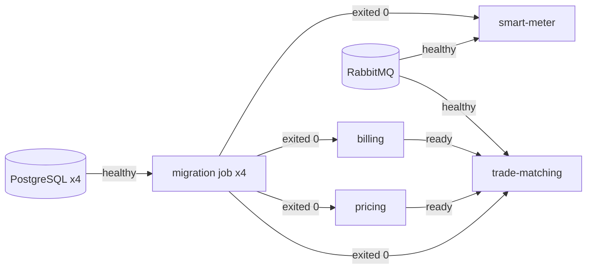

# Solar Grid - Operations

How the Docker stack is put together to run like production: credentials,
database privileges, images, health checks, shutdown and resource limits.

## Starting the stack

```bash
pnpm env:init                                            # once: writes infrastructure/.env
docker compose -f infrastructure/docker-compose.yml up -d --build --wait
bash scripts/demo.sh
```

`up` runs in this order:



`docker compose ps -a` shows ten running containers, all `healthy`, and four
migration jobs that have `Exited (0)`. The tenth is the operator dashboard,
which depends on nothing: it is static files, and the browser calls the
services itself.

## Credentials

Nothing secret has a default in the compose file. Every credential is read from
`infrastructure/.env`, and compose refuses to start while one is empty:

```
required variable POSTGRES_PASSWORD is missing a value: Set POSTGRES_PASSWORD in infrastructure/.env (pnpm env:init)
```

`pnpm env:init` copies `infrastructure/.env.example` to `infrastructure/.env`
and fills each empty secret with 32 random bytes as hex. Running it again
keeps every value already set, adds settings that are new in the example, and
prints only variable names. The file is created with mode 600 and is ignored
by git.

| Variable                                                                                       | Used by                                                      |
| ---------------------------------------------------------------------------------------------- | ------------------------------------------------------------ |
| `POSTGRES_PASSWORD`                                                                            | PostgreSQL itself and the migration jobs: the database owner |
| `SMART_METER_DB_PASSWORD`, `PRICING_DB_PASSWORD`, `MATCHING_DB_PASSWORD`, `LEDGER_DB_PASSWORD` | each service's runtime role, one per database                |
| `RABBITMQ_USER`, `RABBITMQ_PASSWORD`                                                           | the broker, smart-meter, trade-matching                      |
| `OPERATOR_API_TOKEN`                                                                           | every service, for the statistics endpoints                  |
| `INTERNAL_API_TOKEN`                                                                           | trade-matching, billing                                      |
| `METRICS_TOKEN`                                                                                | every service, to protect `/metrics`                         |

Each container receives only the variables it uses. The billing container, for
instance, has its runtime database URL, the internal token and - since its
statistics endpoints ask for one - the operator token; it has no owner
password and no broker password.

### Refusing unsafe configuration

With `NODE_ENV=production` - which is how the Docker stack runs - a service
refuses to start when:

- a token it uses is missing, shorter than 32 characters, or a development
  placeholder (`not-for-production`)
- any two of the operator, internal and metrics tokens are the same value
- `DATABASE_URL` or `RABBITMQ_URL` carries no password, a password shorter than
  16 characters, or a well-known one (`postgres`, `guest`, `password`, `test`,
  `change-me`, ...)
- once connected, the database role turns out to be a superuser, the owner of
  the database, or the owner of any table

It logs every reason at once, by variable name, never by value, and exits with
status 1:

```
ERROR [Bootstrap] Refusing to start with an unsafe configuration:
  - The database role "postgres" is a superuser; connect as the runtime role.
  - The database role "postgres" owns the database; connect as the runtime role.
```

Outside production the same findings are warnings, so `pnpm start:dev` works
against whatever a developer has locally.

## Database privileges

Each database has two roles:

| Role            | Created by                                   | Used by                 | Can                                                  |
| --------------- | -------------------------------------------- | ----------------------- | ---------------------------------------------------- |
| `postgres`      | the image, from `POSTGRES_PASSWORD`          | the migration job       | everything: it owns the database and every table     |
| `solargrid_app` | `infrastructure/postgres/create-app-role.sh` | the service, at runtime | log in, and exactly what `runtime-grants.sql` grants |

The runtime role is not a superuser, cannot create databases or roles, cannot
create anything in the schema, and owns nothing. What it may do per table is
listed in each service's `prisma/runtime-grants.sql`, which the migration job
applies after `prisma migrate deploy`:

| Service        | Table                     | Privileges             |
| -------------- | ------------------------- | ---------------------- |
| smart-meter    | `meter_readings`          | SELECT, INSERT         |
|                | `household_energy_status` | SELECT, INSERT, UPDATE |
|                | `outbox_events`           | SELECT, INSERT, UPDATE |
| pricing        | `pricing_rules`           | SELECT, INSERT         |
|                | `price_snapshots`         | SELECT, INSERT         |
| trade-matching | `sell_offers`             | SELECT, INSERT, UPDATE |
|                | `buy_requests`            | SELECT, INSERT, UPDATE |
|                | `trade_matches`           | SELECT, INSERT, UPDATE |
| billing        | `completed_trades`        | SELECT, INSERT         |
|                | `ledger_entries`          | SELECT, INSERT         |
|                | `idempotency_keys`        | SELECT, INSERT         |
|                | `household_balances`      | SELECT, INSERT, UPDATE |

No service can DELETE or TRUNCATE anything, and billing's ledger is append-only
in the database as well as in the code: an UPDATE on a ledger entry is refused
by PostgreSQL. No runtime role can read `_prisma_migrations`.

The grants file revokes everything before granting, inside one transaction, so
it is the complete statement of the role's privileges and re-applying it is
harmless while the service runs.

### Adding a table

1. Write the migration as usual.
2. Add the table to that service's `prisma/runtime-grants.sql` with only the
   privileges the code needs.

The `runtime-privileges` integration test of each service fails while any table
lacks a grant, and every service's suite exercises its real writes as the
runtime role - trade-matching's reserve, bill and confirm scenarios, billing's
whole HTTP API.

### Volumes created before the runtime role existed

The init script runs only when a volume is first created. For an existing
volume, either start clean (`pnpm docker:clean`, which deletes the data) or run
the script by hand and re-run the migration job:

```bash
docker compose -f infrastructure/docker-compose.yml exec postgres-ledger \
  sh /docker-entrypoint-initdb.d/10-create-app-role.sh
docker compose -f infrastructure/docker-compose.yml up -d billing-migrate
```

The same applies to RabbitMQ, whose user is created when its volume is.

## Images

Each service's Dockerfile builds these stages, after one that only installs
OpenSSL and copies the workspace manifests:

| Stage     | Contents                                                           | Shipped                       |
| --------- | ------------------------------------------------------------------ | ----------------------------- |
| `build`   | every dev dependency, compiles the shared packages and the service | no                            |
| `migrate` | `build` plus the Prisma CLI, running as `node`                     | as the one-shot migration job |
| `deploy`  | `pnpm deploy --prod`: the service with only its own dependencies   | no                            |
| `runtime` | `node:24-alpine`, OpenSSL, and the `deploy` output                 | as the service                |

The runtime image has no compiler, no Prisma CLI or migration engines, no
Prisma WebAssembly engines, no sources, and no npm, npx, corepack or yarn. The
application files belong to root; the process runs as `node` (uid 1000) and
cannot change them.

|                          | Single stage | Now       |
| ------------------------ | ------------ | --------- |
| Image size (per service) | ~895 MB      | ~360 MB   |
| `/app`                   | ~340 MB      | ~91-96 MB |
| User                     | root         | node      |

The pnpm store is a BuildKit cache mount shared by every build, so a package is
downloaded once per machine rather than once per image, and never ends up in a
layer.

### Container hardening

Every Node container - services and migration jobs - runs with:

- a read-only root filesystem and a 16 MB `tmpfs` at `/tmp`
- all Linux capabilities dropped (`CapEff: 0000000000000000`)
- `no-new-privileges`

The dashboard container is hardened the same way from a different base: the
unprivileged nginx image runs as uid 101, with a read-only filesystem, an 8 MB
`/tmp`, no capabilities and no credentials. See
[dashboard.md](dashboard.md#docker).

PostgreSQL and RabbitMQ keep their images' defaults: their entrypoints need to
change file ownership and users when a volume is initialised.

## Health checks

| Endpoint            | Answers                                                    | Touches dependencies   |
| ------------------- | ---------------------------------------------------------- | ---------------------- |
| `GET /health/live`  | the process is running and serving HTTP                    | never                  |
| `GET /health/ready` | the dependencies needed for useful work answer; 503 if not | yes, 2 s deadline each |
| `GET /health`       | same as `/health/live`, kept for existing clients          | never                  |

Liveness never depends on another system: a database outage must not get a
healthy process restarted, which would only add a restart to the outage.

What readiness requires:

| Service        | Database | RabbitMQ                                                                                    |
| -------------- | -------- | ------------------------------------------------------------------------------------------- |
| smart-meter    | critical | reported, not critical: readings are stored with their events and published when it returns |
| pricing        | critical | -                                                                                           |
| trade-matching | critical | critical: consuming events is most of its job                                               |
| billing        | critical | -                                                                                           |

Readiness does not include other services. trade-matching staying ready while
pricing is down is deliberate: its consumer retries, and a readiness check that
followed every downstream would take the whole system out with one service.

```json
{
  "status": "not_ready",
  "service": "billing-ledger-service",
  "timestamp": "2026-09-17T13:24:52.269Z",
  "checks": { "database": { "status": "down", "critical": true, "durationMs": 2001 } }
}
```

The body never says why a dependency is down; the service logs that once, when
it goes down, and again when it comes back. Health endpoints are not rate
limited.

Compose's healthchecks call `/health/ready`, because compose uses health to
decide when dependants may start. Docker has no liveness restarts; the
`restart: unless-stopped` policy covers a process that exits. On Kubernetes the
same endpoints would be the liveness and readiness probes.

## Graceful shutdown

On SIGTERM or SIGINT a service closes in this order:

1. readiness turns `503 shutting_down`
2. trade-matching cancels its consumer, so the broker delivers nothing more,
   and waits for the messages already being handled; smart-meter stops the
   outbox publisher after the event it is publishing
3. the HTTP server stops accepting connections and lets requests in flight finish
4. the broker connection closes
5. the database pool closes

Then the process exits with status 0. Each service shuts down in 10-15 ms when
idle.

If this takes longer than `SHUTDOWN_TIMEOUT_MS` (25 s, below compose's 30 s
`stop_grace_period`) the process logs it and exits with status 1. Nothing is
lost that way either: an unacknowledged message is redelivered and deduplicated,
an outbox row not yet marked is published again, and a trade reserved but not
confirmed is settled by the next matching run. A second Ctrl+C exits at once.

The messaging integration test holds a message mid-handling, starts the
shutdown, and checks that the consumer is cancelled at once, a message arriving
meanwhile stays queued, the database closes only after the first message is
acknowledged, and the next consumer receives exactly the queued message.

## Observability and failures

Logs, correlation ids and metrics are described in
[observability.md](observability.md); diagnosing and recovering from a failure
in [troubleshooting.md](troubleshooting.md). To check that the stack survives
its dependencies failing:

```bash
bash scripts/resilience.sh
```

It stops and starts each dependency in turn - a database, the broker, pricing,
billing, trade-matching itself - and checks that every outage is reported,
handled and recovered from, that one correlation id can be followed through all
four services' logs, and that no secret appears in any log. It changes the
stack's state, so run it on a local stack only.

## Resource limits

| Container       | Memory limit | Reservation | CPUs | Idle usage |
| --------------- | ------------ | ----------- | ---- | ---------- |
| each service    | 256 MiB      | 64 MiB      | 1.0  | 44-50 MiB  |
| each PostgreSQL | 256 MiB      | 64 MiB      | 1.0  | 23-40 MiB  |
| RabbitMQ        | 512 MiB      | 128 MiB     | 1.0  | ~121 MiB   |
| migration job   | 384 MiB      | -           | 1.0  | exits      |

RabbitMQ applies flow control at 40% of its limit, slowing publishers rather
than running out of memory.

## Troubleshooting

| Symptom                                                               | Cause and fix                                                                                                          |
| --------------------------------------------------------------------- | ---------------------------------------------------------------------------------------------------------------------- |
| `required variable ... is missing a value`                            | No `infrastructure/.env`, or a secret is empty. Run `pnpm env:init`.                                                   |
| A service exits with `Refusing to start with an unsafe configuration` | Read the listed reasons; each names the variable to fix.                                                               |
| `password authentication failed for user "solargrid_app"`             | The volume predates the runtime role, or its password changed. See "Volumes created before the runtime role existed".  |
| A migration job exits 1 with `role "solargrid_app" does not exist`    | Same as above.                                                                                                         |
| `ACCESS_REFUSED` from RabbitMQ                                        | The broker volume was created with other credentials. `pnpm docker:clean`, then `up`.                                  |
| A service stays `health: starting`                                    | `curl localhost:<port>/health/ready` says which dependency is down; the service log says why.                          |
| `permission denied for table ...` in a service log                    | The code writes somewhere its grants do not allow. Add the privilege to `runtime-grants.sql` if the write is intended. |
| Anything that goes wrong once the stack is running                    | See [troubleshooting.md](troubleshooting.md).                                                                          |
